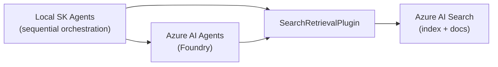

# Semantic Kernel Agents — Integration path to Azure AI Foundry Agents

## Overview

This folder demonstrates building local Semantic Kernel (SK) agents and the migration / integration path to creating corresponding Azure AI agents (Azure AI Foundry / Azure AI Agent Service).

To integrate Semantic Kernel (SK) with Azure AI Foundry agents:

- Create an Azure AI Foundry project and deploy a model or default agent.
- Configure your SDK with the project's endpoint (see `AZURE_AI_AGENT_ENDPOINT` environment variable).
- Define your agent and its tools (plugins) within Semantic Kernel.
- Use the SK `AzureAIAgent` client to create and invoke the agent so it can run on Foundry's serverless infrastructure and call built-in tools.

For migration, update your SDK to the latest Semantic Kernel version (1.31.0+), remove any old project connection string usage, and point to the Foundry project's endpoint using `AZURE_AI_AGENT_ENDPOINT`.

## Steps for integration

1. Create an Azure AI Foundry Project: deploy a model in the Azure AI Foundry portal to create a project and default agent.
2. Configure your SDK:
   - Obtain the endpoint URL from your Foundry project in the portal.
   - Create an AzureAI settings object in your SK code and set the endpoint.
   - Use the settings object to create an `AzureAIAgent` client.
3. Define the agent:
   - Create your Semantic Kernel agent definition, specifying model instructions and policies.
   - Add built-in Foundry tools (code interpreter, file search, Bing grounding, etc.) or custom plugins for extra functionality.
4. Create and invoke the agent:
   - Use the `AzureAIAgent` client to create the agent from your definition.
   - Invoke the agent on a thread to execute instructions and leverage Foundry tools.

## Key artifacts

- `agents/az_ai_agents.ipynb` — examples that create `AzureAIAgent`, `AzureAIAgentSettings`, `AzureAIAgentThread`, and wire `SearchRetrievalPlugin`.
- `agents/sk_agent_orchestration_loop.ipynb` — sequential orchestration examples using local SK agents.
- `agents/utils.py` — credential helpers and small utilities.

## Design summary

- Local SK agents: host sequential orchestration, lightweight decision logic, and pre/post-processing.
- Azure AI agents (Foundry): run model execution on the service for governance and scale.
- Integration path: map SK agent instructions and plugins to Azure agent definitions so service-side agents can call the same retrieval plugin and follow the same instruction set.

## Semantic Kernel agent implementation (key features)

1. Short-term memory via thread object — Done
   - Conversation and short-term state carried in `AzureAIAgentThread` / thread objects in the notebooks.
2. Long-term memory — N/A
   - Not implemented in these examples.
3. Evaluation — N/A
   - No automated evaluation pipeline included in these notebooks.
4. Function calling via plugins — Done
   - Retrieval from Azure AI Search multimodal RAG index and other external functions are implemented as plugins (e.g., `SearchRetrievalPlugin()`).
5. Observability — Planned
   - Not included yet. Plan: add OpenTelemetry for local SK agents and Azure Monitor / Log Analytics for Azure AI agents.
6. Multiagent orchestration — Sequential orchestration (Done)
   - Examples show explicit sequential orchestration between two SK agents. Azure AI agent orchestration is yet to be implemented.
7. MCP (Multi-Client Policy) — N/A

## Plugins & retrieval

- `SearchRetrievalPlugin()` queries an Azure AI Search multimodal RAG-based index and returns full fields and provenance.
- Recommended: always surface raw search results (definition, context, note, page number) and present them verbatim; allow agents to summarize without inventing facts.

## Sequence: Local SK → Azure AI Foundry agents (short steps)

1. Provision Azure AI (Agent Service / Foundry) and Azure Cognitive Search; load documents.
2. Implement `SearchRetrievalPlugin` (returns full fields + provenance).
3. Build local SK agents with sequential orchestration, plugins and thread/state handling.
4. Create Azure agent on Foundry with the same instructions (use `AzureAIAgentSettings`, `client.agents.create_agent(...)`).
5. Wire plugins to the Azure agent: `AzureAIAgent(..., plugins=[SearchRetrievalPlugin()])`.
6. Use `AzureAIAgentThread` for conversation state and call `agent.invoke(...)`.
7. Validate retrieval outputs, provenance, and thread handoffs end-to-end.

## Sequential orchestration on local SK agents

- Sequential orchestration executes multiple agents in sequence: the output of one agent becomes the input to the next.
- The notebooks show creating and starting a runtime, creating a sequential orchestration, and invoking the orchestration.

## Simple architecture diagram

ASCII:

Local SK Agents (sequential orchestration)
  ├─> SearchRetrievalPlugin ──> Azure AI Search (index + documents)
  └─> Map instructions & state ──> Azure AI Agents (Foundry) ──> (can also call SearchRetrievalPlugin)

Optional Mermaid:

